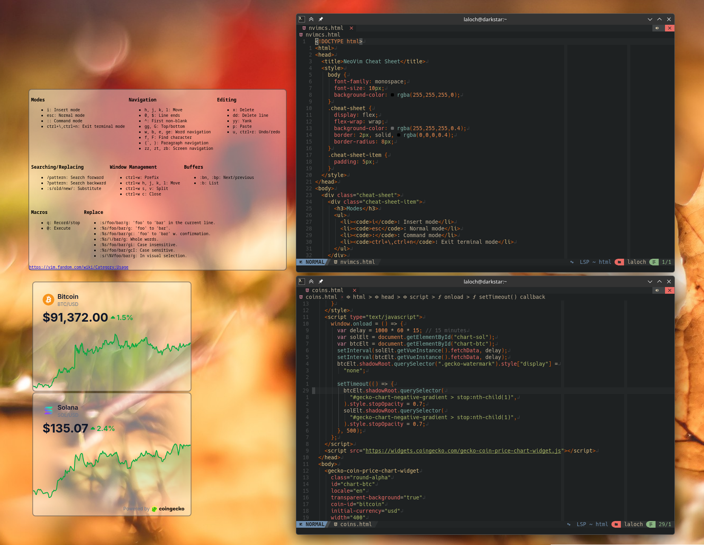

# HTML View (Plasma 6 Widget)

A powerful and versatile HTML/Web view widget for KDE Plasma 6, designed for dashboards, monitoring tools, and custom desktop content. 

**Key Differentiator:** Support for **Local Files** with drag-and-drop loading, making it perfect for custom local dashboards or HTML widgets.



## Features

*   **Local & Remote:** Seamlessly switch between local HTML files and remote URLs.
*   **Drag & Drop:** Drag an HTML file or a remote URL onto the widget to load it instantly.
*   **Suspension Mode:** "Pause" the widget (via toolbar) to stop rendering and **disable JavaScript**, saving CPU/RAM when not in use (e.g., for 3D printer dashboards like Mainsail).
*   **Transparency:** 
    *   Supports transparent backgrounds (select "Transparent" in Appearance).
    *   **Force Transparency:** Optional script to remove backgrounds from stubborn opaque websites/SPAs.
*   **Security & Isolation:**
    *   Runs in an isolated WebEngine profile (cookies/cache don't leak to other widgets).
    *   Configurable security policies (Mixed Content, Remote Access for local files).
    *   Option to ignore certificate errors (e.g., self-signed).
*   **Usability:** 
    *   Auto-hiding navigation toolbar (Back/Forward/Reload/Suspend).
    *   Toggleable scrollbars.
    *   Zoom/Scale control.
    *   CTRL-click on a link opens the link target in the default browser.

## Installation

### From Source
1.  Ensure you have `kpackagetool6` installed.
2.  Navigate to the directory containing this package.
3.  Run the install command:

```bash
kpackagetool6 --install .
```

To upgrade:
```bash
kpackagetool6 --upgrade .
```

## Configuration Guide

### General
*   **Source:** Choose between URL or Local File.
*   **Refresh:** Set optional auto-refresh interval.
*   **Security:**
    *   *Mixed Content:* Allow HTTP content on HTTPS pages.
    *   *Access Control:* Allow local files to fetch remote resources (CORS).
    *   *Certificates:* Ignore SSL errors (useful for self-hosted local tools).

### Appearance
*   **Background:** Choose "Transparent" (No Background) for a floating widget look.
*   **Force Transparency:** Enable this if your web page has a white background you can't remove. It attempts to strip the background via JS.
*   **Scrollbars:** Toggle visibility.

### Usage Tips
*   **Suspend:** Hover over the bottom of the widget to see the toolbar. Click "Suspend" to freeze the widget and stop JavaScript execution. Click "Resume" to continue.

## License
GPLv3
